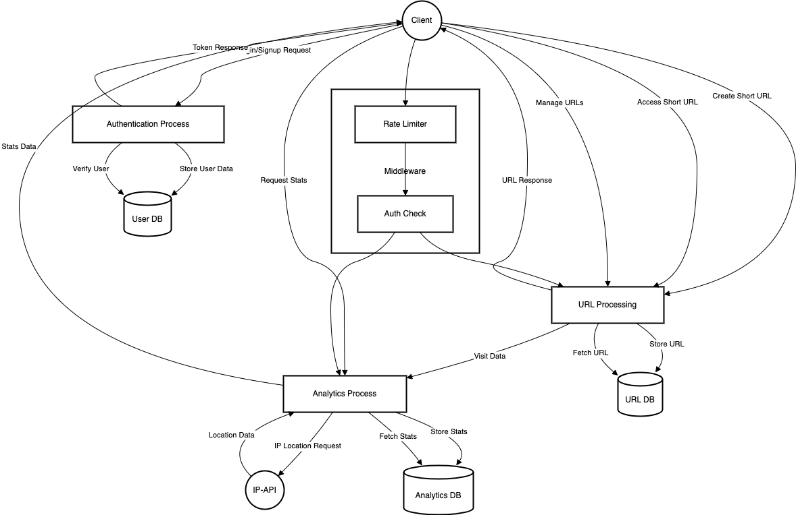
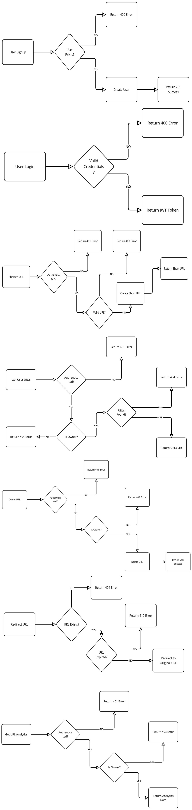

# URL Shortener Service

A simple URL shortener built with Node.js and TypeScript. This service allows users to shorten long URLs, track analytics, and manage their shortened URLs. The service uses PostgreSQL as the database, with TypeORM ORM for database interaction and migration management.

# Table of Contents

1. [Introduction](#introduction)
2. [Features](#features)
3. [Use Cases](#use-cases)
4. [Data Flow Diagram (DFD)](#data-flow-diagram-dfd)
5. [Entity-Relationship Diagram (ERD)](#entity-relationship-diagram-erd)
6. [Installation](#installation)
    - [Clone the repository](#clone-the-repository)
    - [Install dependencies](#install-dependencies)
    - [Set up environment variables](#set-up-environment-variables)
    - [Start the application](#start-the-application)
7. [Database Setup](#database-setup)
    - [Database Configuration](#database-configuration)
    - [Database Migrations with TypeORM](#database-migrations-with-typeorm)
        - [Generate a new migration](#generate-a-new-migration)
        - [Create a new migration file](#create-a-new-migration-file)
        - [Run pending migrations](#run-pending-migrations)
        - [Revert the last applied migration](#revert-the-last-applied-migration)
        - [Show the status of migrations](#show-the-status-of-migrations)
8. [API Endpoints](#api-endpoints)
    - [Authentication](#authentication)
        - [POST /api/user/signup](#post-apikeysignup)
        - [POST /api/user/login](#post-apikeylogin)
    - [URL Management](#url-management)
        - [GET /api/manage/urls](#get-apimanageurls)
        - [DELETE /api/manage/:hash](#delete-apimanagehash)
    - [URL Shortening](#url-shortening)
        - [POST /api/url/shorten](#post-apiurlshorten)
        - [GET /api/url/:hash](#get-apiurlhash)
    - [URL Analytics](#url-analytics)
        - [GET /api/url/analytics/:hash](#get-apiurlanalyticshash)
9. [Authentication](#authentication-1)
10. [Rate Limiting](#rate-limiting)
11. [Validation](#validation)
12. [Error Handling](#error-handling)
13. [Example Usage](#example-usage)


## Features

- **Unique Hash Generation**: Shorten URLs with a unique identifier.
- **URL Redirection**: Redirect from short URLs to original long URLs.
- **Click Tracking**: Track analytics like location, browser, and device.
- **Expiration Dates**: Set an expiration date for shortened URLs.
- **Manage URLs**: View and delete your shortened URLs.

## Use Cases

- Marketing campaigns to track engagement.
- Social media sharing of short links.
- Custom branded short URLs for promotions.
- Generate custom short links for affiliate programs and track click-through rates and commissions.
- Shorten links for events and conferences, making it easy to track the number of registrations or attendees.

Here is the Data Flow Diagram (DFD) for the project:



Here are the Entity-Relationship Diagrams (ERDs) for the project:



## Installation

1. Clone the repository:
    ```bash
    git clone https://github.com/your-username/url-shortener.git
    cd url-shortener
    ```

2. Install dependencies:
    ```bash
    npm install
    ```

3. Set up environment variables:
    Create a `.env` file in the root directory of the project with the following content:
    ```
    DB_HOST=localhost
    DB_PORT=5432
    DB_USERNAME=<your-username>
    DB_PASSWORD=<your-password>
    DB_NAME=<your-db-name>
    JWT_SECRET=<your-strong-jwt-secret-key>
    BASE_URL=http://localhost:3000
    PORT=3000
    ```
    - Replace `<your-username>`, `<your-password>`, and `<your-db-name>` with your PostgreSQL credentials.
    - Set `<your-strong-jwt-secret-key>` to a **strong, secure string** for JWT authentication.

4. Start the application:
    ```bash
    npm run dev
    ```

    The app will start on `http://localhost:3000`.

## Database Setup

The project uses **PostgreSQL** with **TypeORM** for database management. You can configure and migrate the database using the commands listed below.

### Database Configuration

PostgreSQL connection details are configured using individual environment variables for host, port, username, password, and database name, as specified in the `.env` file. The TypeORM configuration is located in `src/config/data-source.ts`.

### Database Migrations with TypeORM

The project uses **TypeORM** migrations to manage changes to the database schema in a versioned manner. Migrations are essential for maintaining database consistency across different environments (development, staging, production). You can generate, run, revert, and show the status of migrations using the following commands:

- **Generate a new migration**:
    ```bash
    npm run migration:generate -- -n <migration-name>
    ```
    This generates a new migration file in the `src/migrations` directory.

- **Create a new migration file** (empty migration file):
    ```bash
    npm run migration:create -- -n <migration-name>
    ```
    This creates an empty migration file for custom changes.

- **Run pending migrations**:
    ```bash
    npm run migration:run
    ```
    This applies all pending migrations to the database.

- **Revert the last applied migration**:
    ```bash
    npm run migration:revert
    ```
    This reverts the last applied migration.

- **Show the status of migrations**:
    ```bash
    npm run migration:show
    ```
    This displays the status of all migrations (whether they've been run or not).

## API Endpoints

This API defines the following endpoints:

### Authentication

*   **`POST /api/user/signup`**: Registers a new user.
    *   Request Body:
        *   `email` (string, required): User's email address.
        *   `password` (string, required): User's password.
    *   Responses:
        *   `201 Created`: User successfully registered.
        *   `400 Bad Request`: User already exists or invalid input.
        *   `500 Internal Server Error`: Error creating user.

*   **`POST /api/user/login`**: Logs in a user.
    *   Request Body:
        *   `email` (string, required): User's email address.
        *   `password` (string, required): User's password.
    *   Responses:
        *   `200 OK`: Login successful, returns a JWT token.
        *   `400 Bad Request`: Invalid email or password.
        *   `500 Internal Server Error`: Error logging in.

### URL Management

*   **`GET /api/manage/urls`**: Gets all URLs owned by the authenticated user. Requires authentication.
    *   Responses:
        *   `200 OK`: Returns a list of URLs.
        *   `401 Unauthorized`: User needs to be authenticated.
        *   `404 Not Found`: No URLs found for this user.
        *   `500 Internal Server Error`: Error retrieving URLs.

*   **`DELETE /api/manage/:hash`**: Deletes a specific shortened URL by its hash. Requires authentication and ownership.
    *   Path Parameters:
        *   `hash` (string, required): The hash of the shortened URL to delete.
    *   Responses:
        *   `200 OK`: URL successfully deleted.
        *   `401 Unauthorized`: User needs to be authenticated.
        *   `404 Not Found`: URL not found or user does not have permission.
        *   `500 Internal Server Error`: Error deleting the URL.

### URL Shortening

*   **`POST /api/url/shorten`**: Shortens a URL. Requires authentication.
    *   Request Body:
        *   `originalUrl` (string, required): The URL to shorten.
        *   `expirationDate` (string, optional): ISO 8601 formatted expiration date.
    *   Responses:
        *   `200 OK`: Returns the shortened URL.
        *   `400 Bad Request`: Invalid or missing original URL.
        *   `401 Unauthorized`: Authentication required.
        *   `500 Internal Server Error`: Error shortening URL.

*   **`GET /api/url/:hash`**: Redirects to the original URL.
    *   Path Parameters:
        *   `hash` (string, required): The hash of the shortened URL.
    *   Responses:
        *   `301 Moved Permanently`: Redirects to the original URL.
        *   `404 Not Found`: URL not found.
        *   `410 Gone`: The URL has expired.
        *   `500 Internal Server Error`: Error processing the URL.

### URL Analytics

*   **`GET /api/url/analytics/:hash`**: Gets analytics for a shortened URL. Requires authentication and ownership.
    *   Path Parameters:
        *   `hash` (string, required): The hash of the shortened URL.
    *   Responses:
        *   `200 OK`: Returns analytics data (visit count, browser, device, location).
        *   `401 Unauthorized`: User needs to be authenticated.
        *   `403 Forbidden`: User is not the owner of the URL.
        *   `404 Not Found`: URL not found.
        *   `500 Internal Server Error`: Error retrieving analytics.

## Authentication

All routes under `/api/manage` and `/api/url/shorten`, `/api/url/analytics` are protected by JWT (JSON Web Token) authentication. You'll need to include a valid JWT in the `Authorization` header as a Bearer token.

## Rate Limiting

All routes are protected by rate limiting to prevent abuse.

## Validation

Input validation is performed on all relevant routes to ensure data integrity.

## Error Handling

The API returns appropriate HTTP status codes and error messages in case of errors.

## Example Usage

Example `POST /api/url/shorten` request:

```json
{
  "originalUrl": "[https://www.example.com](https://www.example.com)",
  "expirationDate": "2024-12-31T23:59:59Z"
}
